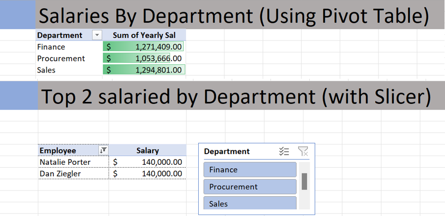

<h1>Data Analyst Cohort 1 </h1>
<h2>PROJECT-1 Excel </h2>

- <b>The aim of this project was to analyze employee salary data to derive meaningful insights using Excel's pivot tables, conditional formatting, and slicers. The goal was to understand salary distributions, trends, and factors influencing compensation within the organization. 
</b>

  
- [My Data EXCEL Project](Shantelle Excel - Project v2 4-25-24.xlsx)
